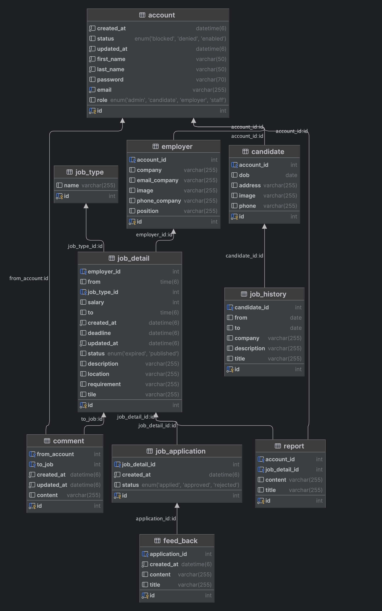

# Parttime Job Project By Ast
ver: Parttime_Job_v1.0

## Introduction
In today's fast-paced world, many individuals are looking for flexible work options that fit their schedules and lifestyles without having a website specializing in supporting part-time job finds.They find it difficult to find a part-time job on job sites or Facebook.  The part-time job website connects candidate with suitable opportunities and employers with their potential candidatets. The website helps part-time candidate browse and find job opportunities that fit their skills and schedule, and employers can reach suitable candidates.

## Diagram Database Design

## Part
- ModelMapper
- Specification
- HATEOAS

- Create/Update Form
- Transaction 
- Validate
- Internationalization
- Swagger 3.0
- Spring Data Rest

- Global Exception
- JWT Authentication 
- Log4j 
